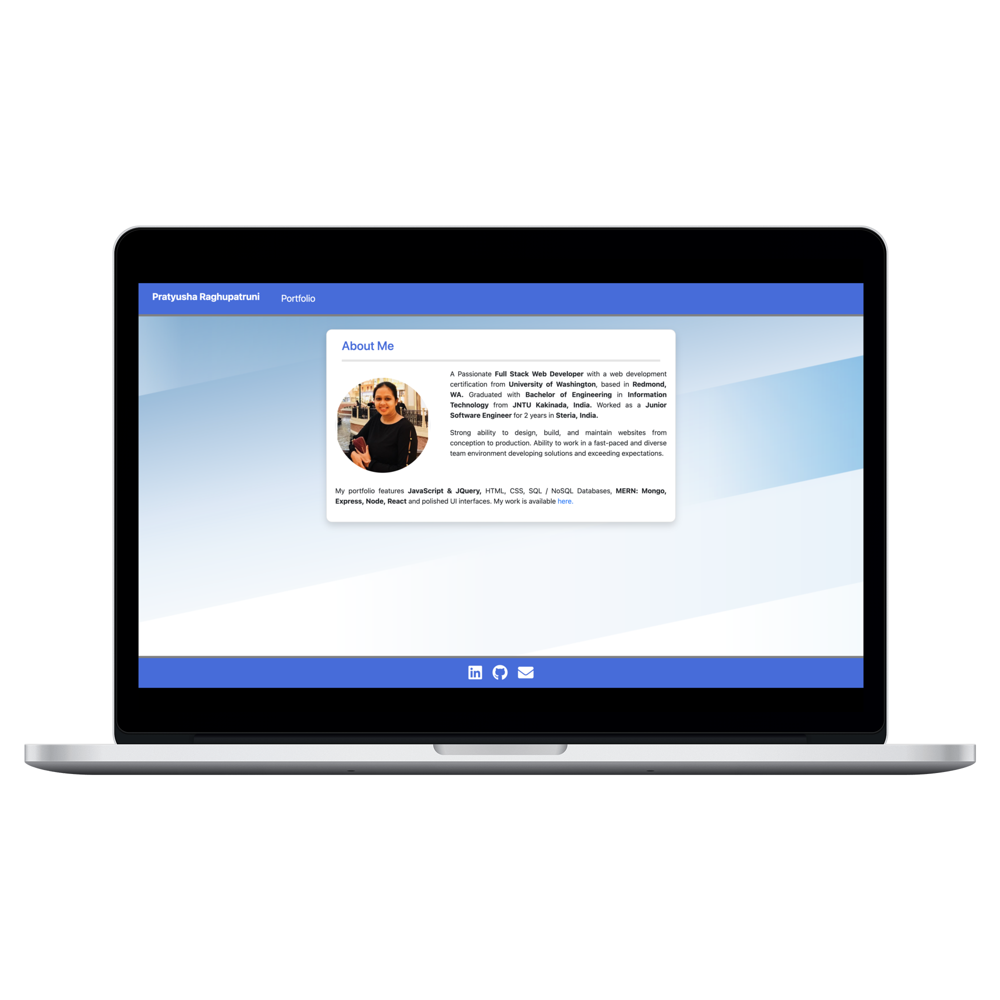
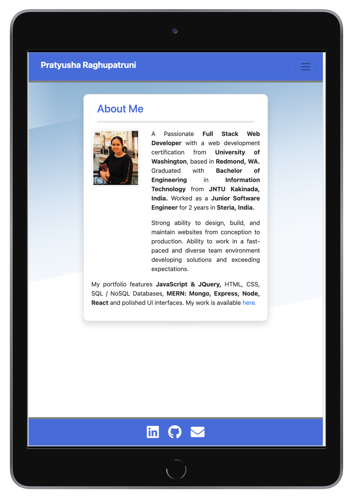
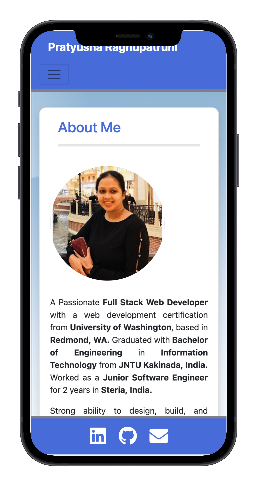
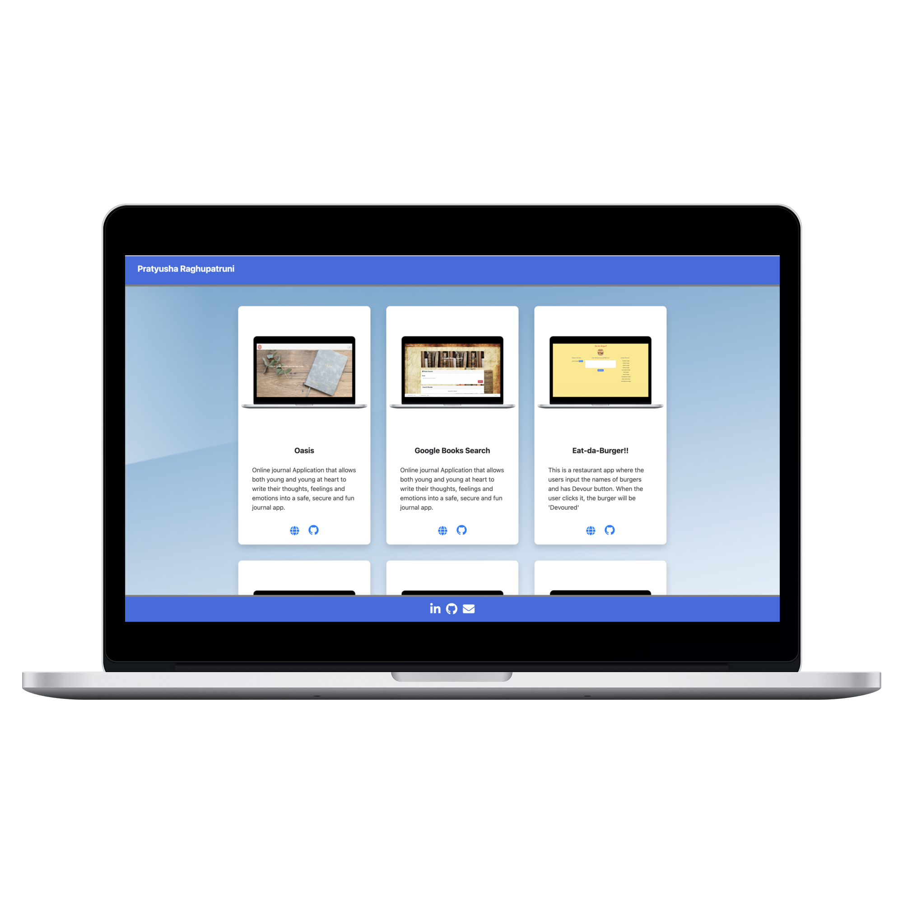

# Responsive Portfolio

### Description

As a Full Stack Web Developer, I want to have an application created with the latest technologies to feature a collection of the best projects I have developed so far, So that I can also showcase my professional value in a competitive way to employers .

This portfolio features relevant technologies such as JavaScript, HTML, CSS, SQL / NoSQL Databases, MERN: Mongo, Express, Node, React, and polished UI interfaces.

Every featured project presents a brief description, and functional icons to see the live application and to see the Github repository. The footer includes links to my main internet handles on Github, LinkedIn, my Resume and a link to contact me by email. 

#### **[Deployed Application](https://pratyusharaghupatruni.github.io/updated-responsive-portfolio/)**

### Table of Contents

*  [Features](#features)
*  [Preview](#preview)
*  [Technology](#technology)
*  [Contributing](#contributing)
*  [Questions](#questions)
*  [License](#license)

### Features

* A polished UI Interface
* About me page about my introduction
* A navbar featuring a link to the projects I developed
* A footer having a links to my github,linkedin,my contact and resume
* Portfolio page featuring 9 projects with a preview image of my project and a description
* Every project presents buttons to launch the app and to see the github repository
* Mobile first responsive application across devices

### Preview :
#### Landing Page

|Medium Devices/ Laptop|Small Devices/ Tablet|Extra Small Devices/Phone
|--|--|--
|||

#### Portfolio Page

|Medium Devices/ Laptop|
|--|
||

### Technology

#### Application 
 * HTML
 * CSS
 * Bootstrap UI

### Contributing

Please let us know how I can improve this project. Issues and pull requests are always welcome.

* [Pratyusha Raghupatruni](https://github.com/PratyushaRaghupatruni)

### Questions :

* If you have any questions about the repo, here is our repo to submit issue 
  https://github.com/PratyushaRaghupatruni/oasis/issues/new

### License

This project is licensed under MIT License.

  
  

